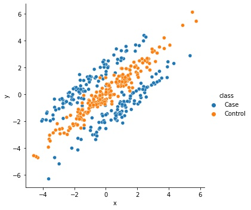
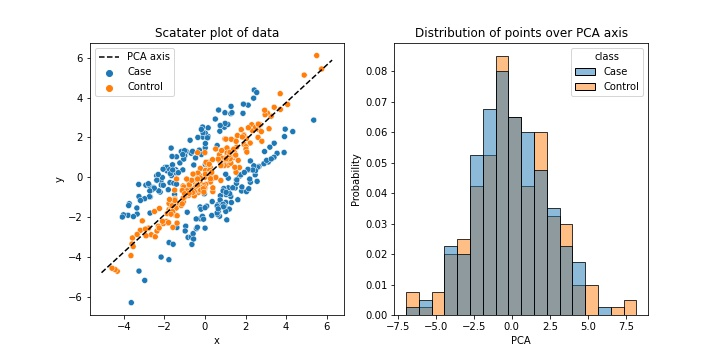

# Projection for Separation
This repo is an investigation to an generalization of PCA called **Probabilistic contrastive principal component analysis** and is based on the original paper found
[here](https://arxiv.org/abs/2012.07977).
## - A short look at the PCPCA as dimension reduction tool

PCA is a great tool to get a quick overview of your data at hand. However, in some situations, it will not give you what you are looking for. Let's say you have the data in the top figure to the right, and that we want to perform a dimension reduction down to one dimension. Here the *Case* and *Control* classes could stand for men and woman, sick and healty, or control group and case group. The PCA will find the direction of greatest variation and project down the data points onto that axis. Since the direction of greatest variance is clearly diagonally from the bottom left up to the top right, while the difference between the classes are in the orthogonal direction, PCA will not meaningfully be able to seperate the classes in its 1D-projection. The figure below shows the axis computed by PCA and the histogram over the corresponding projection.

So PCA might not be a *one-fits-all* sollution, but we still need a way to tackle this issue. Without opening the can of worms named **non-linear**, we could first see if there exist a reasonable linear transform. The gif below shows how the distribution of the two classes varies on the projection axis as the axis is rotated. Not too suprisingly, there seem to be a projection which seperates the two classes at around 135 degrees (when the line is going from top left to bottom right).  

So we now know there exists a solution, but hwo to we go about finding it? Well we can first take a look at the construction of the PCA, maybe we can alter the definition to our favour. 

The general objective of PCA is to find the direction in the data which corresponds to the largest variance. In the upper row of the equation below, we can see a more precise way of putting it. The C here is the covariance matrix of the data. In our case, however, we do not have one set of data but two, lets call them X and Y for the case and control respectily. With this notation, we are looking for a direction which has a large varaince in X but not Y. So why not set the a 'reward' for a large variance in X and a 'penalty' for large variance in Y. More concrete, lets set make the variance in X count positivly to our maximization problem and the variance in Y as negativly. Finally, let's combine them via a linear combination. Doing this takes us to the secound row of the equation with gamma as a linear parameter. 

We now have an equation which is very similar to our original one but which contrasts the different kinds of data we have against eachother. The method it results in is called Contrastiv PCA (CPCA). 

CPCA is a very successful method but it lacks some of the theoretical structure which we would like to have in our model. I will not go into it now, maybe I will come back and finish this work, but a good source is to look into the original paper (PCPCA) or search for probibalistic PCA (it is the first P in PCPCA). Putting all of this together finally leads to our final model. Implementing it on our data and varying gamma gives the results below. It is not perfect, but is getting us closer at least. 

<\p>

